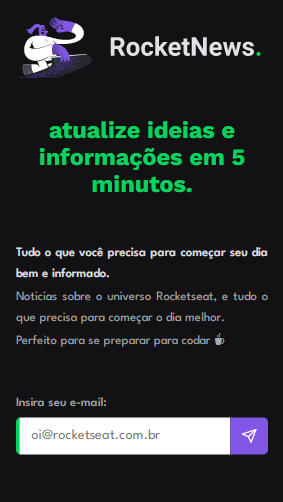
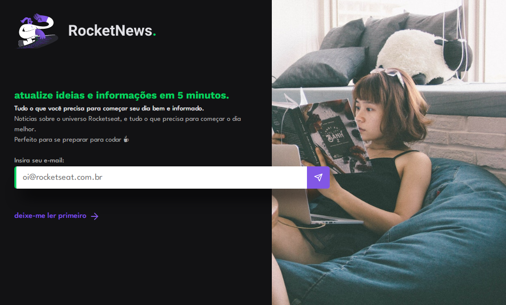

# [RocketNews](https://liarleycodie.github.io/RocketNews/)

Proposed challenge by Rocketseat.

A difference compared to the challenge itself is that I changed few things, such as background and shading.

If you click in register button while email input is clean, a small alert will be triggered, otherwise it will show
a pop-up alert saying that you are registered.

And different from the proposed challenge, this project was initially applied using the mobile first concept. Therefore, it is fully responsive!

